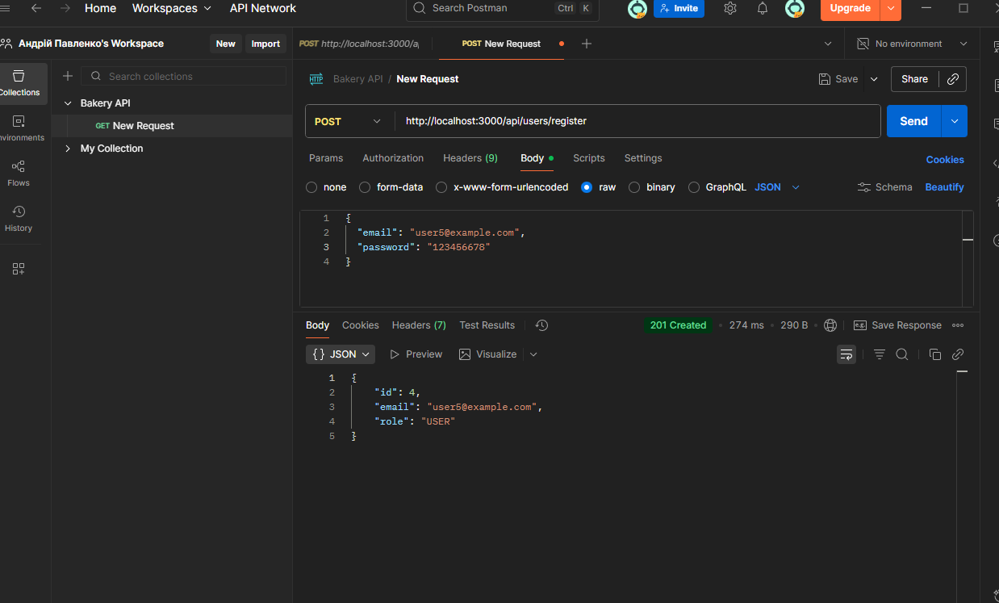
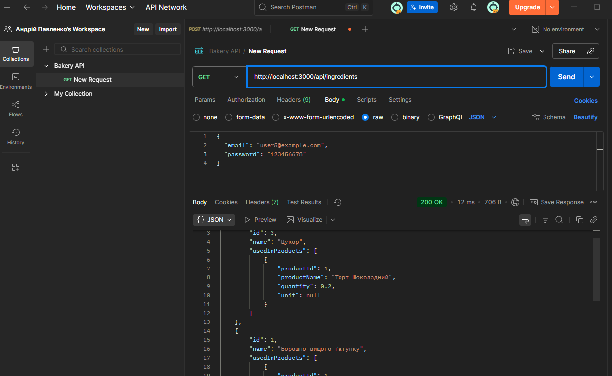
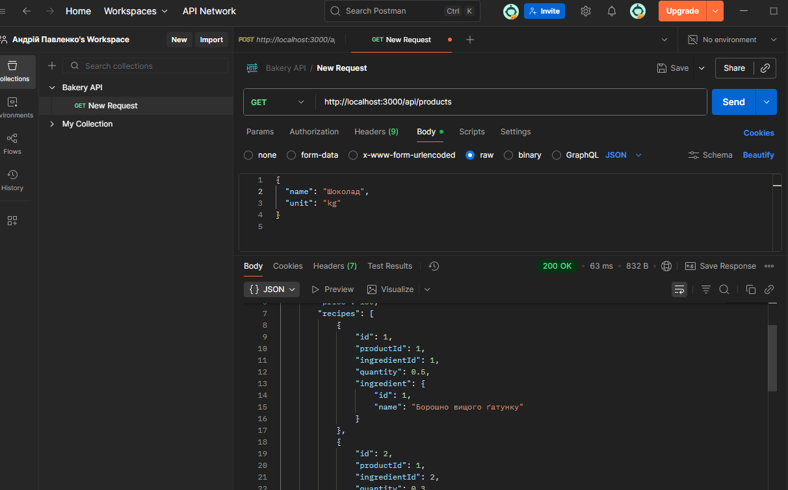
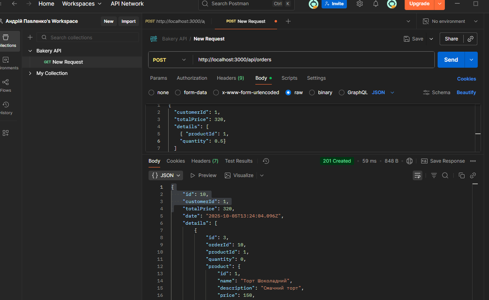
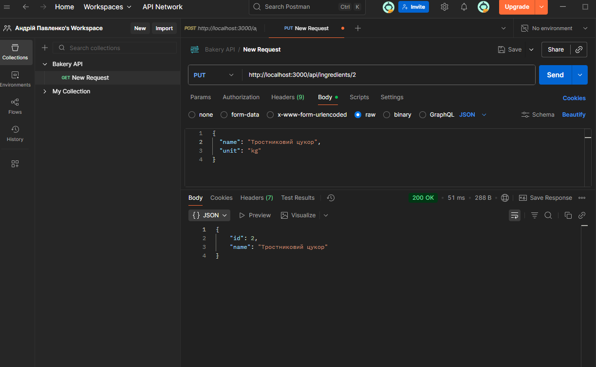
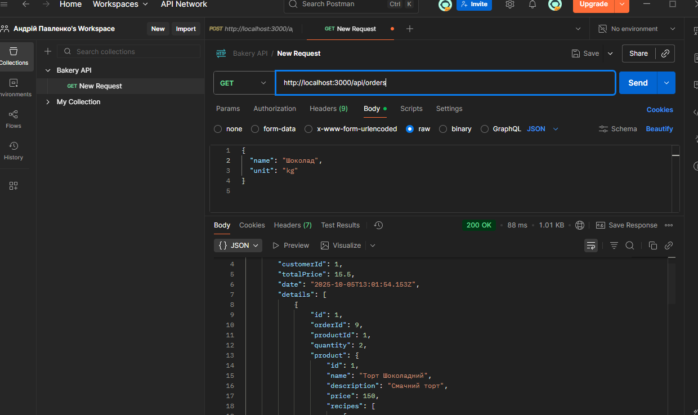

# Звіт з лабораторної роботи 1
## Тема роботи: Розроблення backend архітектури та основного функціоналу для керування пекарнею та кондитерською

Здобувач освіти: Андрій Павленко
Група: ІПЗ-42
GitHub репозиторій: https://github.com/Desinomo

## Виконання роботи
## Налаштування проєкту

- Ініціалізовано Node.js проект (npm init -y).
- Встановлено залежності: express, prisma, @prisma/client, bcrypt, jsonwebtoken, express-validator, dotenv.

## Створено структуру папок:

src/
├─ controllers/
├─ routes/
├─ middleware/
├─ utils/
└─ app.js
prisma/
reports/
.env
.gitignore
package.json

## База даних

- Налаштовано PostgreSQL на порту 1570.
- Створено Prisma схему (prisma/schema.prisma) з таблицями:
- User — id, email, password, role
- Customer — id, firstName, lastName, email
- Product — id, name, description, price
- Ingredient — id, name, unit
- Recipe — id, productId, ingredientId, quantity
- Order — id, customerId, date, totalPrice

## Виконано міграцію бази даних:

npx prisma migrate dev --name init

## Реалізовано seed для створення початкового адміністратора (дані з .env).

## Backend архітектура

- Express.js сервер (src/app.js) підключає маршрути та middleware.
- Middleware:
- express.json() — обробка JSON;
- authenticateToken — перевірка JWT;
- requireRole("ADMIN") — доступ лише для ADMIN;
- errorHandler — централізована обробка помилок.

## API endpoints
# User

- POST /api/users/register — реєстрація (PUBLIC)
- POST /api/users/login — логін (PUBLIC)
- GET /api/users — отримати всіх користувачів (ADMIN)

# Customer

- GET /api/customers — всі клієнти (PUBLIC)
- GET /api/customers/:id — клієнт по id (PUBLIC)
- POST /api/customers — створити (ADMIN)
- PUT /api/customers/:id — оновити (ADMIN)
- DELETE /api/customers/:id — видалити (ADMIN)

# Ingredient

- GET /api/ingredients — всі інгредієнти (PUBLIC)
- GET /api/ingredients/:id — інгредієнт по id (PUBLIC)
- POST /api/ingredients — створити (ADMIN)
- PUT /api/ingredients/:id — оновити (ADMIN)
- DELETE /api/ingredients/:id — видалити (ADMIN)

# Recipe

- GET /api/recipes — всі рецепти (PUBLIC)
- GET /api/recipes/:id — рецепт по id (PUBLIC)
- POST /api/recipes — створити (ADMIN)
- PUT /api/recipes/:id — оновити (ADMIN)
- DELETE /api/recipes/:id — видалити (ADMIN)

# Product

- GET /api/products — всі продукти (PUBLIC)
- GET /api/products/:id — продукт по id (PUBLIC)
- POST /api/products — створити (ADMIN)
- PUT /api/products/:id — оновити (ADMIN)
- DELETE /api/products/:id — видалити (ADMIN)

# Order

- GET /api/orders — всі замовлення (ADMIN)
- GET /api/orders/:id — замовлення по id (ADMIN)
- POST /api/orders — створити замовлення (USER)
- PUT /api/orders/:id — оновити (ADMIN)
- DELETE /api/orders/:id — видалити (ADMIN)

## Структура проєкту
lab1-web-programming/
├── src/
│   ├── controllers/
│   │   ├── userController.js
│   │   ├── customerController.js
│   │   ├── productController.js
│   │   ├── ingredientController.js
│   │   ├── recipeController.js
│   │   └── orderController.js
│   ├── routes/
│   │   ├── userRoutes.js
│   │   ├── customerRoutes.js
│   │   ├── productRoutes.js
│   │   ├── ingredientRoutes.js
│   │   ├── recipeRoutes.js
│   │   └── orderRoutes.js
│   ├── middleware/
│   │   ├── auth.js
│   │   └── errorHandler.js
│   ├── utils/
│   │   └── validation.js
│   └── app.js
├── prisma/
│   ├── schema.prisma
│   └── seed.js
├── reports/
│   └── lab1-report.md
├── .env
├── .gitignore
├── package.json
└── README.md
## Скріншоти тестування

## Звіт з лабораторної роботи 1
## Висновки

- Backend реалізовано для всіх сутностей з аутентифікацією і ролями.
- CRUD та валідація даних працюють коректно.
- Seed-скрипт створює початкового адміністратора.

## Тестування через Postman підтвердило роботу всіх endpoints.

# Самооцінка: 5/5
# Обґрунтування: Повний функціонал реалізовано, усі ендпоінти протестовано, помилки обробляються, JWT токен захищає адмінські маршрути.
