# Звіт з лабораторної роботи №2
## Тема роботи: Аутентифікація, авторизація та розширений функціонал
Здобувач освіти: Андрій Павленко
Група: ІПЗ-42
GitHub репозиторій: https://github.com/Desinomo

## Виконання роботи
Ця лабораторна робота є розширенням архітектури, створеної в попередній роботі. Було додано новий функціонал, що відповідає Рівню 2 та частково Рівню 3 складності, з акцентом на безпеку, зручність використання та тестування.

# 1. Налаштування проєкту та нові залежності
Для реалізації нового функціоналу було встановлено додаткові пакети:

multer: для обробки завантаження файлів (multipart/form-data).

swagger-jsdoc та swagger-ui-express: для автоматичної генерації інтерактивної документації API.

nodemailer: для реалізації системи відновлення пароля через email.

Безпека: helmet (встановлює безпечні HTTP-заголовки), express-rate-limit (обмежує кількість запитів), cors (налаштування політики міждоменних запитів).

Тестування: jest та supertest для написання та запуску автоматизованих тестів API.

Оновлено файл .env новими змінними для JWT, файлового сервісу та налаштувань пошти.

# 2. Оновлення бази даних
Схему Prisma (prisma/schema.prisma) було розширено для підтримки нового функціоналу:

До моделі User додано поля passwordResetToken та passwordResetExpires для реалізації безпечного відновлення пароля.

Створено нову модель File для зберігання метаданих про завантажені файли.

Виконано нову міграцію бази даних для застосування цих змін: npx prisma migrate dev --name add_password_reset_and_files

# 3. Розширення Backend архітектури
Middleware:

Створено middleware/upload.js з конфігурацією Multer для валідації типів та розмірів файлів перед збереженням.

До app.js додано middleware helmet, cors та rateLimit для підвищення загального рівня безпеки додатку.

Utils:

Створено utils/jwt.js та utils/password.js для інкапсуляції логіки роботи з токенами та хешуванням.

Створено utils/email.js з конфігурацією Nodemailer для відправки електронних листів.

Контролери:

Всі контролери getAll... було розширено для підтримки пагінації, пошуку (search) та фільтрації за різними критеріями, що передаються через req.query.

# 4. Реалізований функціонал та API endpoints
Розширена система аутентифікації
POST /api/auth/refresh: Реалізовано ендпоінт для оновлення accessToken за допомогою refreshToken, що покращує безпеку та досвід користувача.

PUT /api/auth/change-password: Створено захищений ендпоінт для зміни пароля поточним користувачем. Вимагає введення старого пароля для підтвердження.

POST /api/auth/forgot-password: Ендпоінт для запиту на відновлення пароля. Генерує унікальний токен і відправляє лист на вказаний email.

PUT /api/auth/reset-password/:token: Ендпоінт, на який веде посилання з листа. Дозволяє встановити новий пароль, використовуючи тимчасовий токен.

Файловий сервіс
POST /api/files/upload: Захищений маршрут для завантаження одного файлу. Використовує multer для обробки запиту, валідації та збереження файлу на сервері.

GET /api/files/:id: Публічний маршрут для отримання (завантаження) файлу за його ID.

DELETE /api/files/:id: Захищений маршрут для видалення файлу.

Документація та тестування
GET /api-docs: Налаштовано Swagger UI для візуалізації інтерактивної документації. Всі ендпоінти, включаючи нові, детально задокументовані з описом параметрів, тіла запиту, відповідей та схем даних.

Тести: Створено файл tests/auth.test.js з використанням Jest та Supertest. Написано базові тести для перевірки коректної роботи ендпоінтів реєстрації та логіну.

# 5. Оновлена структура проєкту
lab1-web-programming/
├── src/
│ ├── controllers/
│ ├── routes/
│ ├── middleware/
│ ├── utils/
│ ├── config/
│ │ └── swagger.js
│ └── app.js
├── tests/
│ └── auth.test.js
├── prisma/
│ └── ...
├── uploads/
└── ...
# 6. Скріншоти тестування
Інтерактивна документація Swagger UI: 
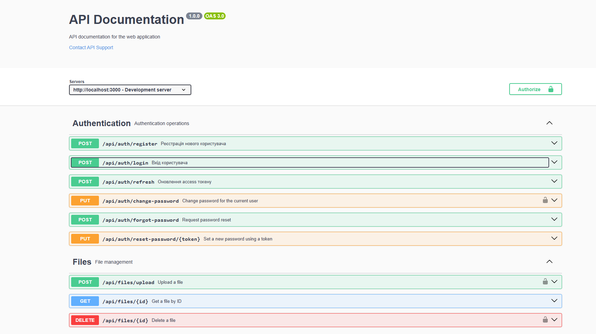
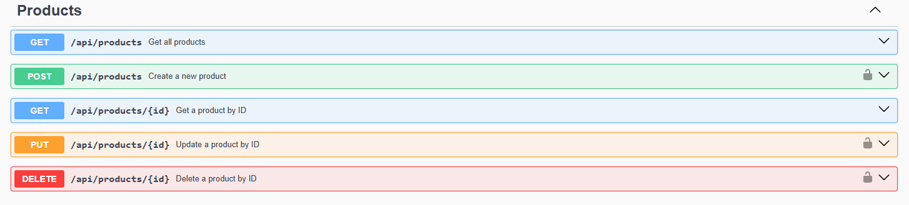
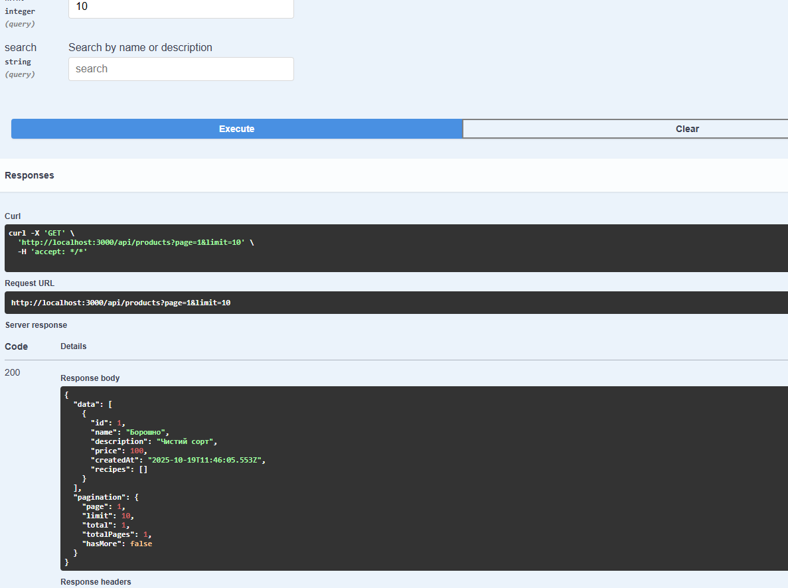
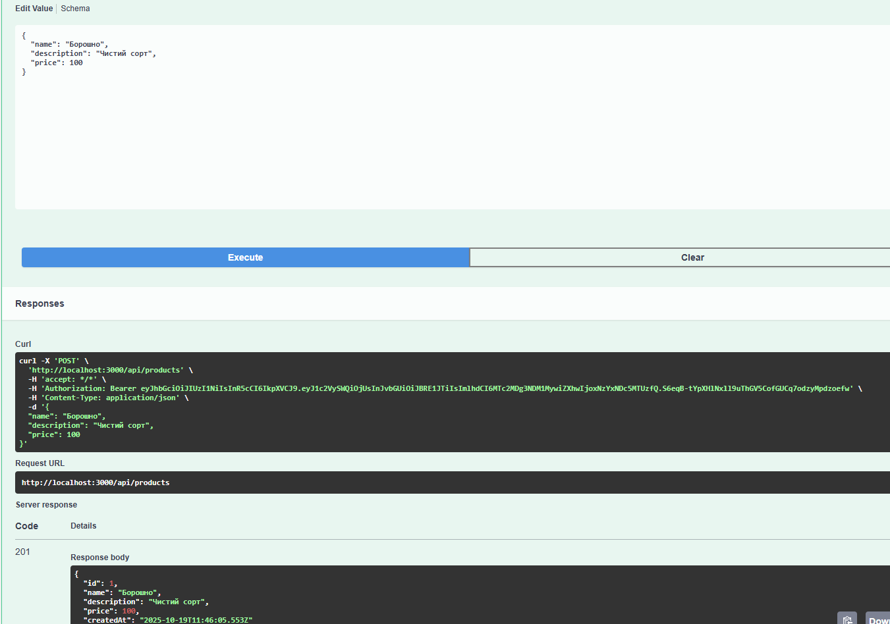
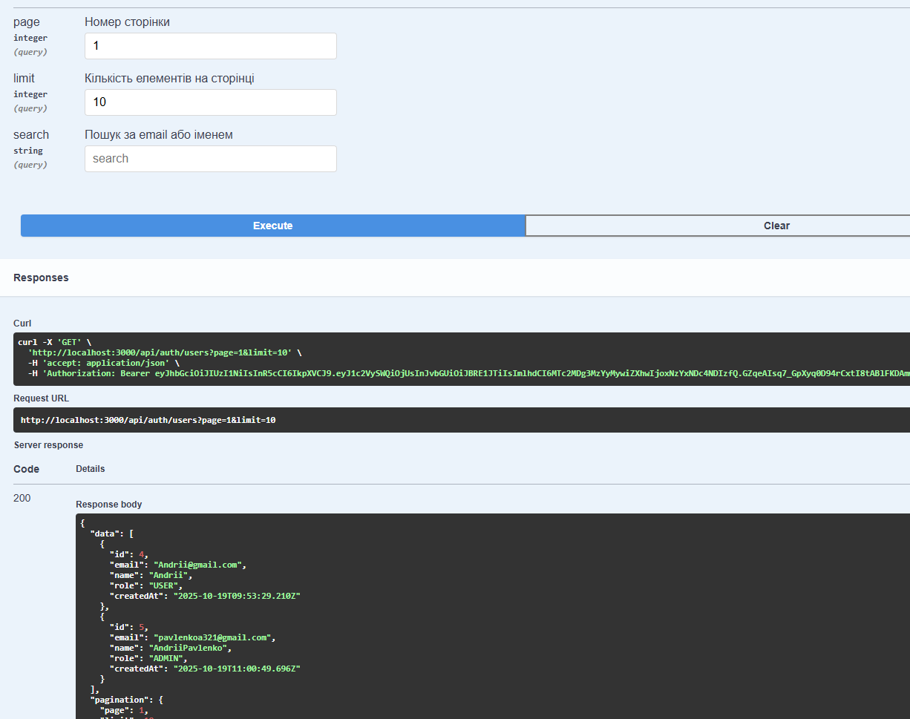
Тестування ендпоінту зміни пароля:
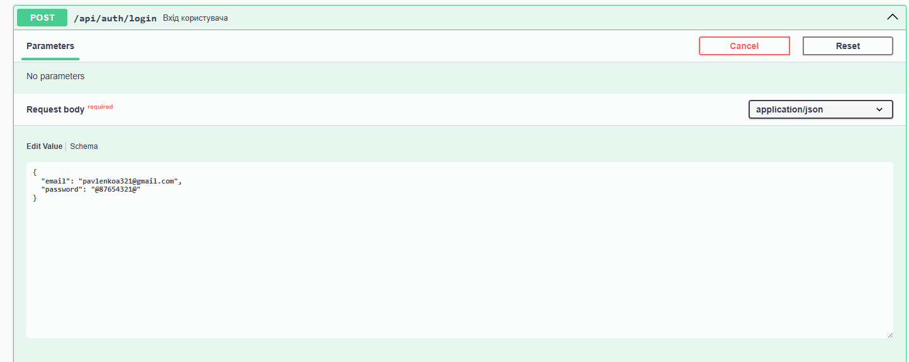
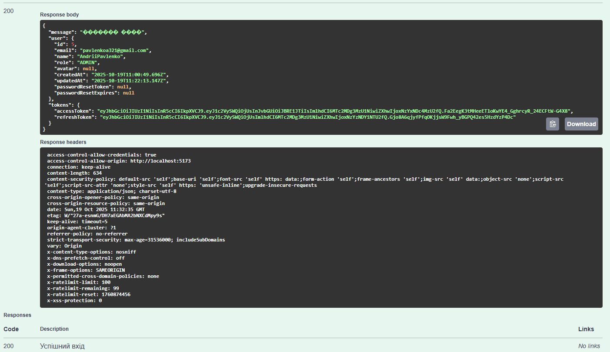
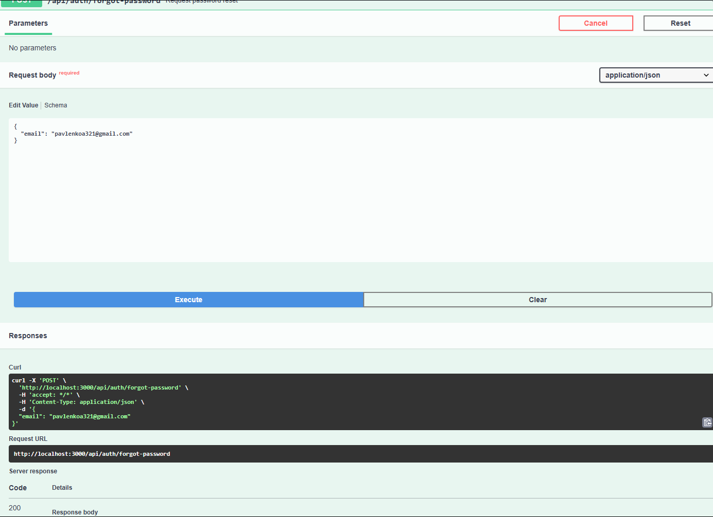
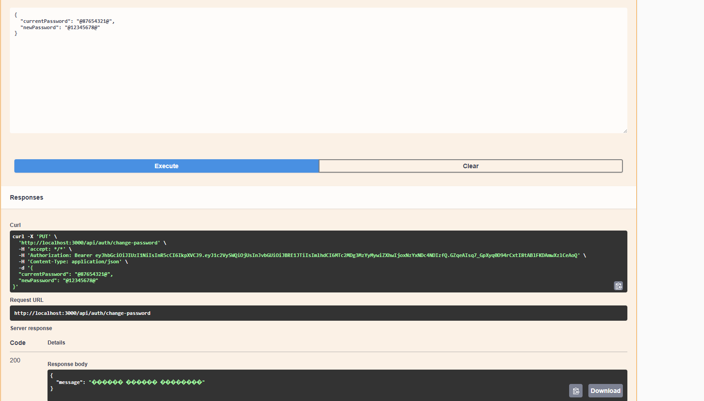
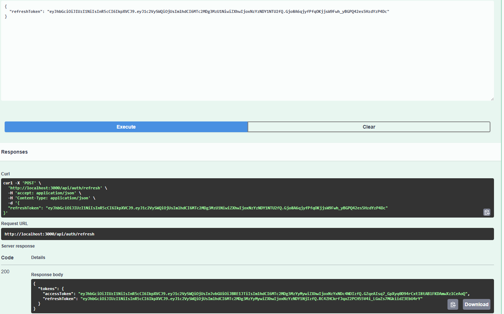
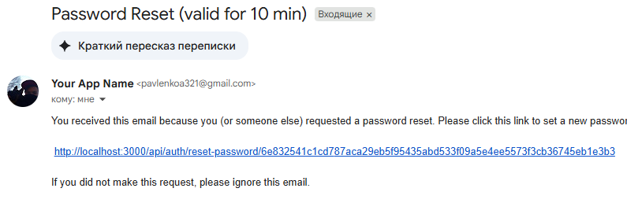
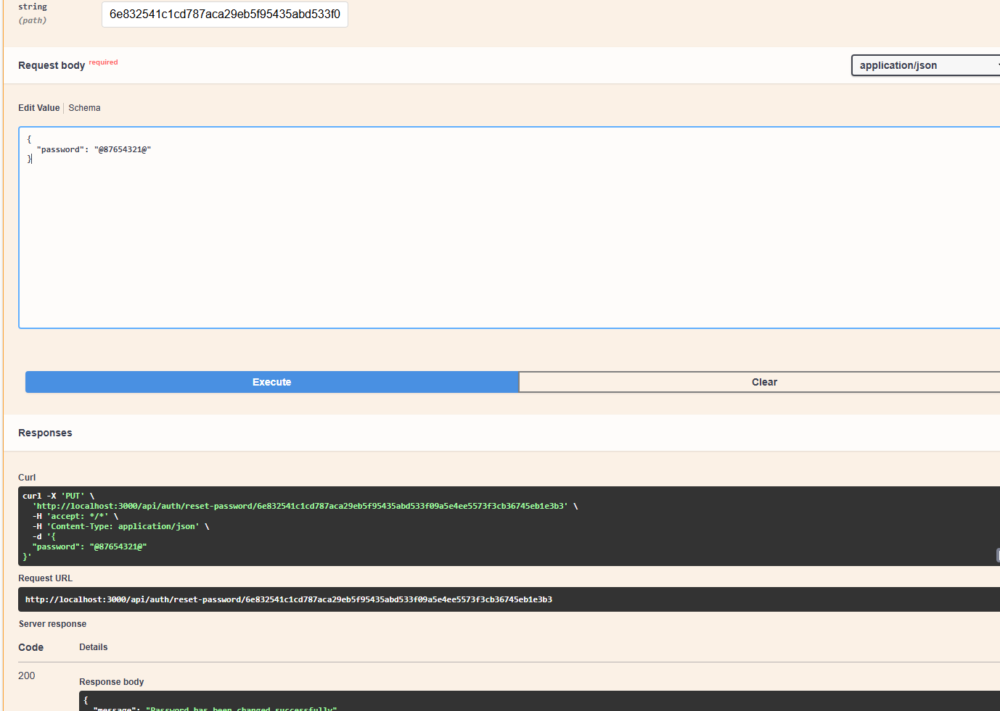
Результати виконання тестів:
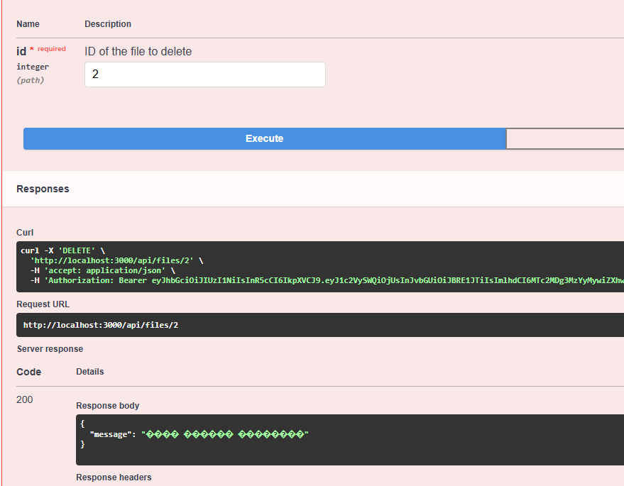
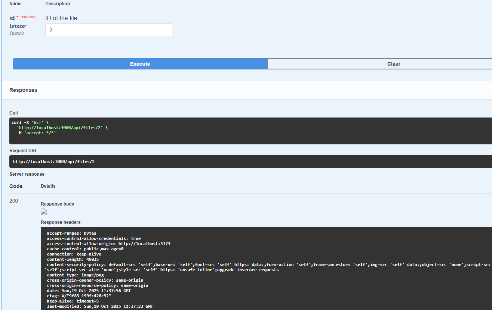
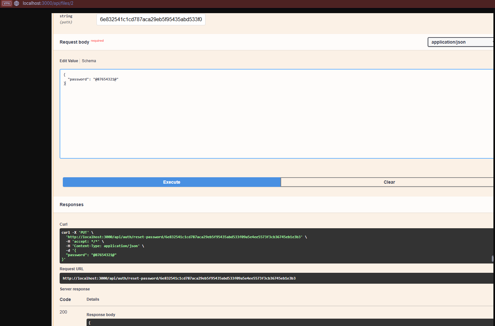
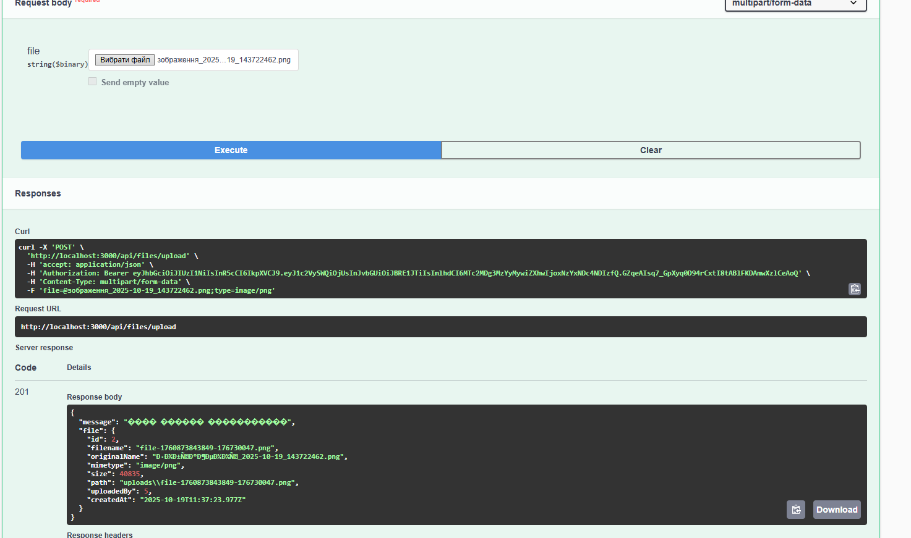

# 7. Висновки
У ході виконання лабораторної роботи було успішно реалізовано весь обов'язковий функціонал Рівня 1 та Рівня 2. Додаток тепер має повноцінну систему аутентифікації з refresh-токенами та зміною пароля, файловий сервіс та розширені можливості для роботи з даними (пошук, фільтрація, пагінація).

Окремо варто відзначити реалізацію функцій, що належать до Рівня 3:

Впроваджено повноцінну систему відновлення пароля через email.

Додано rate limiting для захисту API від зловживань.

Налаштовано базові тести, що закладає фундамент для подальшого покриття коду тестами.

Проєкт має чисту архітектуру, є безпечним та добре задокументованим, що повністю відповідає сучасним стандартам backend-розробки.

Самооцінка: 5/5
Обґрунтування: Всі завдання Рівня 1 та Рівня 2 виконано в повному обсязі. Додатково реалізовано ключові та складні функції з Рівня 3, такі як відновлення пароля та автоматизоване тестування